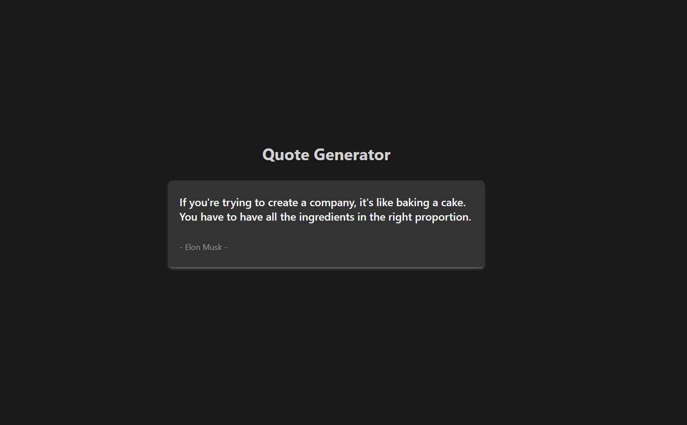
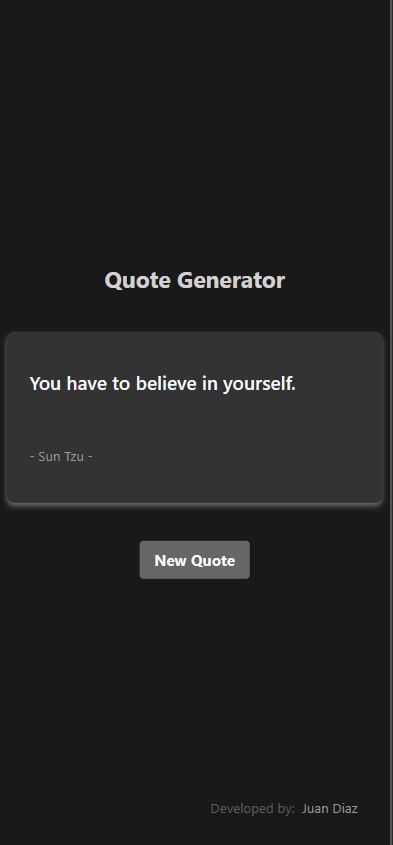

# Random Quote Generator

Simple random quote generator with React, Tailwind CSS and Vite.js.

<!-- ABOUT THE PROJECT -->

## Description 💡

A Quote generator React app that consumes the [Quotable API](https://github.com/lukePeavey/quotable?tab=readme-ov-file#get-random-quotes) to display random quotes. This project was built with React, Tailwind CSS and Vite.js.

### Project

#### [Demo](https://quote.jpdiaz.dev/)

Desktop View 🖥️

 

Mobile view📱

 

<!-- OTHER PROJECTS -->

## Projects 🚀

### Built With 🔑

This project is based on React.js con Vite.js y TailwindCSS

<!-- LICENSE -->

## License 📜

Distributed under the MIT License. See `LICENSE.txt` for more information.

<!-- CONTACT -->

## Contact 📞

<!-- ACKNOWLEDGMENTS -->

## Acknowledgments 📚

Resources list that I find helpful and would like to give credit to.

- [Quotable API](https://github.com/lukePeavey/quotable?tab=readme-ov-file#get-random-quotes)
- [Tailwind CSS](https://tailwindcss.com/)
- [Vite.js](https://vitejs.dev/)
- [React.js](https://reactjs.org/)

(<a href="#top">👆 Top 👆</a>)

