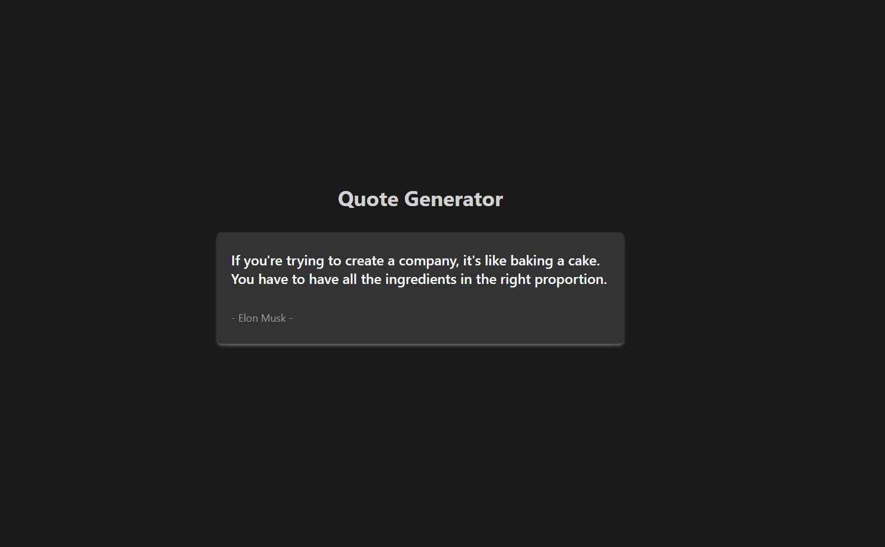

# Random Quote Generator

This simple project is a responsive web application that allows users to generate endless random quotes with the click of a button.

## Description 💡

A Quote generator React app that consumes the [Quotable API](https://github.com/lukePeavey/quotable?tab=readme-ov-file#get-random-quotes) to display random quotes. This project was built as part of the **[freeCodeCamp Front End Libraries Certification](https://www.freecodecamp.org/certification/1diazdev/front-end-development-libraries)**.

### Desktop View 🖥️

### iPad view📱

### Mobile view📱

## Features:

- Responsive design: [random quote generator](https://quote.jpdiaz.dev) adapts to any screen size, ensuring a consistent and enjoyable experience for all users.
- Sleek and modern UI: Tailwind CSS provides a beautiful and intuitive user interface.
- Efficient and performant: Vite.js ensures fast loading times and a smooth experience.
- API integration.

### Built With 🔑

Welcome to [random quote generator](https://quote.jpdiaz.dev), a simple random quote generator build with React, Tailwind CSS and Vite.js.

Here's a closer look at the tech stack:

- Front-End: React.js, Vite.js, Tailwind CSS
- Back-End: API Integration (RESTful)
- Deployment: Vercel

## Get started 🛠️

To get started with [random-quote-generator](https://quote.jpdiaz.dev), simply clone the repository and follow the setup instructions. You'll be up and running in no time!

## Contribution 🤝

I welcome contributions to the [random quote generator](https://quote.jpdiaz.dev)! Feel free to fork the repository and submit pull requests with your improvements.

## License 📜

[random quote generator](https://quote.jpdiaz.dev) is licensed under the MIT License.

We hope you enjoy using the quote generator!

<!-- OTHER PROJECTS -->

## Other Projects 🚀

<!-- CONTACT -->

## Contact 📞

<!-- ACKNOWLEDGMENTS -->

## Acknowledgments 📚

Resources list that I find helpful and would like to give credit to.

- [Quotable API](https://github.com/lukePeavey/quotable?tab=readme-ov-file#get-random-quotes)
- [Tailwind CSS](https://tailwindcss.com/)
- [Vite.js](https://vitejs.dev/)
- [React.js](https://reactjs.org/)
- [Vercel](https://vercel.com/)

(<a href="#top">👆 Top 👆</a>)

